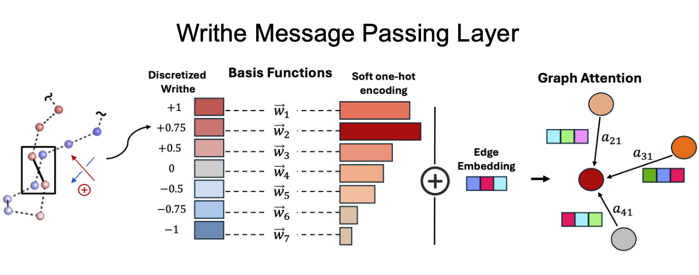

## Code accompanying the paper, 'On the application of knot theoretic geometric descriptors to dynamical and generative models'

  Computation of the writhe and analysis of polymer coordinate data

  
  

The package contains the following ...

- Numerical routines for computing the writhe using CPU or GPU devices. In either case, computations are parallelized over CPU / GPU cores / devices.
- A class architecture for writhe computation and visualization, making implementation and visualization of the results seamless and efficient. 
- An implementation of the novel writhe-based graph attention message passing layer.
- An implementation of the SE3 equivariant, writhe-PaiNN neural network architecture where SE3 equivariance is acheived by only augmenting invariant graph features.
- Implementations of the orginial PaiNN architecture and the cPaiNN achitecture for comparison.
- An implementation of a score based diffusion model to train all architectures.
- Classes to compute (time-lagged) canonical correlation analysis and visualize results.

#### For an example of how to use this package to analyze molecular dynamics simulation data, see analysis_example.ipynb in the examples folder.

#### To train score-based generative models with any of the architectures listed above, see the sbm_scripts folder.

